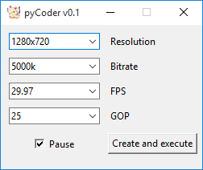

# pyCoder

A simple video and audio converter, functioning as an FFmpeg front-end.

## Installation

1. Download the [latest release](https://github.com/valsaven/pycoder/releases). 
2. Extract the downloaded archive.
3. Run `main.exe`.

## Usage

1. After launching the application, follow these steps:

   a) Place the video files you want to convert into the `In` folder.
 
   b) Open the application and select your desired conversion parameters.

   c) Click the `Create and execute` button.

2. The application will process the selected video files according to the chosen settings.

3. Once the conversion is complete, you can find the converted files in the `Out` folder.

## Building from Source

1. Install Python 3.
2. Add the following path to the PATH environment variable: `%APPDATA%\Python\Python310\Scripts`.
3. Run the provided `build.bat` script.
4. Find the built executable in the `dist` folder.
